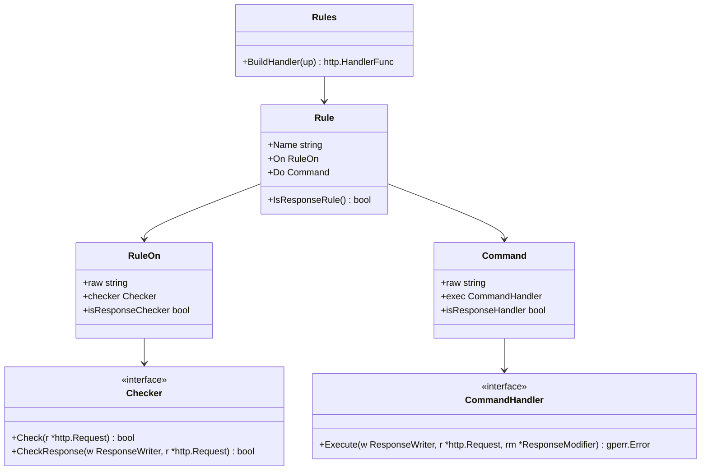
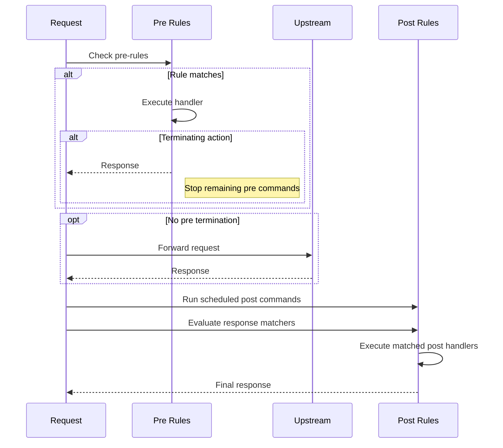

# internal/route/rules

Implements a rule engine for HTTP request/response processing, enabling conditional routing, header manipulation, authentication, and more.

## Overview

The `internal/route/rules` package provides a powerful rule engine for GoDoxy. Rules allow conditional processing of HTTP requests and responses based on various matchers (headers, path, method, IP, etc.). Matching rules can modify requests, route to different backends, or terminate processing.

### Primary Consumers

- **Route layer**: Applies rules during request processing
- **Configuration system**: Parses rule YAML
- **Middleware integration**: Extends rule capabilities

### Non-goals

- Does not implement proxy transport (delegates to reverse proxy)
- Does not handle TLS/SSL (handled at entrypoint)
- Does not perform health checking

### Stability

Internal package with stable YAML schema. Backward-compatible additions to rule types are allowed.

## Public API

### Exported Types

```go
type Rules []Rule

type Rule struct {
    Name string  // Rule identifier for debugging
    On   RuleOn // Condition matcher
    Do   Command // Action to execute
}

type RuleOn struct {
    raw         string
    checker     Checker
    phase PhaseFlag
}

type Command struct {
    raw  string
    pre  Commands
    post Commands
}
```

### Exported Functions

```go
// BuildHandler converts rules to an HTTP handler
func (rules Rules) BuildHandler(up http.HandlerFunc) http.HandlerFunc

// ParseRules parses rule configuration
func ParseRules(config string) (Rules, error)

// ValidateRules validates rule syntax
func ValidateRules(config string) error

// Validate validates rule semantics (e.g., prevents multiple default rules)
func (rules Rules) Validate() gperr.Error
```

## Architecture

### Core Components



### Request Processing Flow



### Execution Model (Authoritative)

Rules run in two phases:

1. **Pre phase**
   - Evaluate only request-based matchers (`path`, `method`, `header`, `remote`, etc.) in declaration order.
   - Execute matched rule `do` pre-commands in order.
   - If a default rule exists (`name: default` or `on: default`), it is a fallback and runs only when no non-default pre rule matches.
   - If a terminating action runs, stop:
     - remaining commands in that rule
     - all later pre-phase commands.
   - Exception: rules that only contain post commands (no pre commands) are still scheduled for post phase.

2. **Upstream phase**
   - Upstream is called only if pre phase did not terminate.

3. **Post phase**
   - Run post-commands for rules whose pre phase executed, except rules that terminated in pre.
   - Then evaluate response-based matchers (`status`, `resp_header`) and execute their `do` commands.
   - Response-based rules run even when the response was produced in pre phase.

**Important:** termination is explicit by command semantics, not inferred from status-code mutation.

### Phase Flags

Rule and command parsing tracks phase requirements via `PhaseFlag`:

- `PhasePre`
- `PhasePost`
- `PhasePre | PhasePost` (combined)

Combined flags are expected for nested/compound commands and variable templates that may need both request and response context.

### Condition Matchers

| Matcher       | Type     | Description                  |
| ------------- | -------- | ---------------------------- |
| `header`      | Request  | Match request header value   |
| `query`       | Request  | Match query parameter        |
| `cookie`      | Request  | Match cookie value           |
| `form`        | Request  | Match form field             |
| `method`      | Request  | Match HTTP method            |
| `host`        | Request  | Match virtual host           |
| `path`        | Request  | Match request path           |
| `proto`       | Request  | Match protocol (http/https)  |
| `remote`      | Request  | Match remote IP/CIDR         |
| `basic_auth`  | Request  | Match basic auth credentials |
| `route`       | Request  | Match route name             |
| `resp_header` | Response | Match response header        |
| `status`      | Response | Match status code range      |

### Matcher Types

```sh
# String: exact match (default)
# Glob: shell-style wildcards (*, ?)
# Regex: regular expressions

path /api/users                // exact match
path glob("/api/*")            // glob pattern
path regex("/api/v[0-9]+/.*")  // regex pattern
```

### Actions

**Terminating Actions** (stop processing):

| Command                        | Description                           |
| ------------------------------ | ------------------------------------- |
| `upstream` / `bypass` / `pass` | Call upstream and terminate pre-phase |
| `error <code> <message>`       | Return HTTP error                     |
| `redirect <url>`               | Redirect to URL                       |
| `serve <path>`                 | Serve local files                     |
| `route <name>`                 | Route to another route                |
| `proxy <url>`                  | Proxy to upstream                     |
| `require_basic_auth <realm>`   | Return 401 challenge                  |

**Non-Terminating Actions** (modify and continue):

| Command                        | Description            |
| ------------------------------ | ---------------------- |
| `rewrite <from> <to>`          | Rewrite request path   |
| `require_auth`                 | Require authentication |
| `set <target> <field> <value>` | Set header/variable    |
| `add <target> <field> <value>` | Add header/variable    |
| `remove <target> <field>`      | Remove header/variable |

**Response Actions**:

| Command                                    | Description       |
| ------------------------------------------ | ----------------- |
| `log <level> <path> <template>`            | Log response      |
| `notify <level> <provider> <title> <body>` | Send notification |

## Configuration Surface

### Rule Configuration (Block Syntax)

```bash
default {
  action1
  action2
}

condition1 &
condition2 {
  action1
  action2
}
```

This is the primary syntax for rules and avoids YAML wrappers.
It keeps the **inner** `on` and `do` DSLs exactly the same (same matchers, same commands, same optional quotes), but wraps each rule in a `{ ... }` block.

#### Key ideas

- A rule is:
  - `default { <do...> }`,
  - `{ <do...> }`, or
  - `<on-expr> { <do...> }`
- Comments are supported:
  - line comment: `// ...` (to end of line)
  - line comment: `# ...` (to end of line, for YAML familiarity)
  - block comment: `/* ... */` (may span multiple lines)
  - Comments are ignored **only when outside quotes** (`"`, `'` or backticks).
  - Environment variable syntax: `${NAME}` is supported by the inner DSL parser in [`parse()`](internal/route/rules/parser.go:34).
    Block-syntax rule:
    - In `on` (rule header): `${...}` must be inside quotes/backticks.
    - In `do` (rule body): `${...}` may be unquoted; the outer parser must treat `${...}` as an opaque token so braces inside it are not structural.

#### Grammar sketch (EBNF-ish)

```text
file        := { ws | comment | rule }
rule        := default_rule | unconditional_rule | conditional_rule

default_rule     := 'default' ws* block
unconditional_rule := ws* block
conditional_rule := on_expr ws* block

block       := '{' do_body '}'

// on_expr and do_body are raw text regions.
// The outer parser only needs to:
// - find the top-level '{' to start a rule block
// - find the matching top-level '}' to end it
// while respecting quotes and comments.
```

#### Elif/Else Chain Grammar

```text
// Elif/Else chains can appear in do_body
do_stmt      := command_line | nested_block | elif_else_chain
elif_else_chain := nested_block { elif_clause } [else_clause]
elif_clause    := 'elif' ws* on_expr ws* '{' do_body '}'
else_clause    := 'else' ws* '{' do_body '}'
```

#### Nested blocks (inline conditionals inside `do`)

Inside a rule body (`do_body`), you can write **nested blocks**:

```text
do_stmt      := command_line | nested_block | elif_else_chain

nested_block := on_expr ws* '{' do_body '}'
```

Notes:

- A nested block is recognized when a line ends with an unquoted `{` (ignoring trailing whitespace).
- `on_expr` uses the same syntax as rule `on` (supports `|`, `&`, quoting/backticks, matcher functions, etc.).
- The nested block executes **in sequence**, at the point where it appears in the parent `do` list.
- Nested blocks are evaluated in the same phase the parent rule runs (no special phase promotion).
- Nested blocks can be chained with `elif`/`else` for conditional execution (see Elif/Else Chains section).

Example:

```go
default {
  remove resp_header X-Secret
  add resp_header X-Custom-Header custom-value
}

header X-Test-Header {
  set header X-Remote-Type public
  remote 127.0.0.1 | remote 192.168.0.0/16 {
    set header X-Remote-Type private
  }
}
```

#### Elif/Else Chains

You can chain multiple conditions using `elif` and provide a fallback with `else`.
The `elif`/`else` keywords must appear on the same line as the preceding closing brace (`}`).

```go
header X-Test-Header {
  method GET {
    set header X-Mode get
  } elif method POST {
    set header X-Mode post
  } else {
    set header X-Mode other
  }
}
```

Notes:

- `elif` and `else` must be on the same line as the preceding `}`.
- Multiple `elif` branches are allowed; only one `else` is allowed.
- The entire chain is evaluated in sequence; the first matching branch executes.
- Elif/else chains can only be used within nested blocks.
- Each `elif` clause must have its own condition expression and block.
- The `else` clause is optional and provides a default action when no conditions match.

#### Examples

Basic default rule:

```go
default {
  bypass
}
```

WebSocket upgrade routing:

```bash
# WebSocket requests
header Connection Upgrade &
header Upgrade websocket {
  route ws-api
  log info /dev/stdout "Websocket request $req_path from $remote_host to $upstream_name"
}
```

Block comments:

```go
/* protect admin area */
path glob("/admin/*") {
  require_auth
}
```

Always log the request

```bash
{
  log info /dev/stdout "Request $req_method $req_path"
}
```

#### Notes and constraints

- The block syntax uses `{` and `}` as structure delimiters at **top-level** (outside quotes/comments).
  - Braces inside quoted strings (including backticks) are not structural.
  - `${...}` handling:
    - `on`: must be quoted/backticked
    - `do`: may be unquoted
      Preferred style: always write env vars as `${NAME}` rather than a bare `$NAME`.
    - If you need literal `{` or `}` outside quotes/backticks (for example unquoted templates like `{{ ... }}`), wrap that argument in quotes/backticks so the outer parser does not treat it as structure.
- Rule naming remains minimal: if no explicit name is provided by the syntax, it will behave like the current YAML behavior (empty name becomes `rule[index]` in [`Rules.BuildHandler()`](internal/route/rules/rules.go:75)).
- YAML remains supported as a fallback for backward compatibility.

### Condition Syntax

```bash
# Simple condition
path /api/users

# Multiple conditions (AND)
header Authorization Bearer & path glob("/api/admin/*")

# Negation
!path glob("/public/*")

# Negation on matcher
path !glob("/public/*")

# OR within a line
method GET | method POST
```

### Variable Substitution

```bash
# Static variables
$req_method      # Request method
$req_host        # Request host
$req_path        # Request path
$status_code     # Response status
$remote_host     # Client IP

# Dynamic variables
$header(Name)           # Request header
$header(Name, index)    # Header at index
$resp_header(Name)      # Response header
$arg(Name)              # Query argument
$form(Name)             # Form field
$postform(Name)         # POST form field
$cookie(Name)           # Cookie value

# Function composition: pass result of one function to another
$redacted($header(Authorization))   # Redact the Authorization header value
$redacted($arg(token))              # Redact a query parameter value
$redacted($cookie(session))         # Redact a cookie value

# $redacted: masks a value, showing only first 2 and last 2 characters
$redacted(value)                    # Redact a plain string

# Environment variables
${ENV_VAR}
```

## Dependency and Integration Map

| Dependency                   | Purpose                  |
| ---------------------------- | ------------------------ |
| `internal/route`             | Route type definitions   |
| `internal/auth`              | Authentication handlers  |
| `internal/acl`               | IP-based access control  |
| `internal/notif`             | Notification integration |
| `internal/logging/accesslog` | Response logging         |
| `pkg/gperr`                  | Error handling           |
| `golang.org/x/net/http2`     | HTTP/2 support           |

## Observability

### Logs

- **DEBUG**: Rule matching details, variable substitution
- **INFO**: Rule execution, terminating actions
- **ERROR**: Rule parse errors, execution failures

Log context includes: `rule`, `alias`, `match_result`

## Security Considerations

- `require_auth` enforces authentication
- `remote` matcher supports IP/CIDR for access control
- Variables are sanitized to prevent injection
- Path rewrites are validated to prevent traversal

## Failure Modes and Recovery

| Failure                | Behavior                  | Recovery                           |
| ---------------------- | ------------------------- | ---------------------------------- |
| Invalid rule syntax    | Route validation fails    | Fix block rule syntax              |
| Multiple default rules | Route validation fails    | Remove duplicate default rules     |
| Missing variables      | Variable renders as empty | Check variable sources             |
| Rule timeout           | Request times out         | Increase timeout or simplify rules |
| Auth failure           | Returns 401/403           | Fix credentials                    |

## Usage Examples

### Basic Pass-Through

```bash
default {
  pass
}
```

### Path-Based Routing

```bash
path glob("/api/*") {
  proxy http://api-backend:8080
}

path glob("/static/*") {
  serve /var/www/static
}
```

### Authentication

```bash
path glob("/admin/*") {
  require_auth
}

path glob("/api/*") {
  require_basic_auth "API Access"
}
```

### Path Rewriting

```bash
path glob("/v1/*") {
  rewrite /v1 /api/v1
  proxy http://backend:8080
}
```

### IP-Based Access Control

```bash
remote 10.0.0.0/8 {
  pass
}

!remote 10.0.0.0/8 &
!remote 192.168.0.0/16 {
  error 403 "Access Denied"
}
```

### WebSocket Support

```bash
header Connection Upgrade &
header Upgrade websocket {
  bypass
}
```

### Default Rule (Fallback)

```bash
# Default runs only if no non-default pre rule matches
default {
  remove resp_header X-Internal
  add resp_header X-Powered-By godoxy
}

# Matching rules suppress default
path glob("/api/*") {
  proxy http://api:8080
}

path glob("/api/*") {
  set resp_header X-API true
}
```

Only one default rule is allowed per route. `name: default` and `on: default` are equivalent selectors and both behave as fallback-only.

## Testing Notes

- Unit tests for all matchers and actions
- Integration tests with real HTTP requests
- Parser tests for block syntax
- Variable substitution tests
- Performance benchmarks for hot paths
